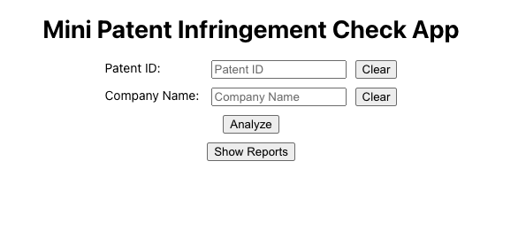

# Patent Analyzer

## Description

The Patent Analyzer is a tool designed to analyze patent infringement based on technical similarities and specific claim elements. It leverages AI technology to provide an objective and thorough analysis of potential infringement between patents and products.

## Prerequisites

Before you begin, ensure you have met the following requirements:

- [Node.js](https://nodejs.org/) installed (version 18)
- [Docker](https://www.docker.com/) installed

## Running the Application

### Using Docker

To run the application with Docker, follow these steps:

0. **Configure environment variables**
   Replace the value of the `OPENAI_API_KEY` environment variable in the`api/.env` file in the root directory with your real OpenAI API key.

1. **Build the Docker image for api**

   ```bash
   docker build -t api ./api

   docker run -p 8080:8080 api
   ```

2. **Build the Docker image for web**

   ```bash
   docker build -t web-client ./client

   docker run -p 3000:3000 web-client
   ```

3. **Start Using the App**

   Go to the browser and open `http://localhost:3000`, you can see the web page.
   

## Endpoints

### 1. Analyze Infringement

- **POST** `/analyze-infringement`
- **Description**: Analyzes if a company infringes on a given patent.
- **Request Body**:
  - `patentId` (string, required): The ID of the patent to analyze.
  - `companyName` (string, required): The name of the company to analyze against the patent.
- **Responses**:
  - **200 OK**: Returns the analysis result.
  - **400 Bad Request**: If `patentId` or `companyName` is missing.
  - **500 Internal Server Error**: If an error occurs during analysis.

### 2. Get Report by Analysis ID

- **GET** `/reports/:analysisId`
- **Description**: Retrieves a report based on the analysis ID.
- **Path Parameters**:
  - `analysisId` (string, required): The ID of the analysis report to retrieve.
- **Responses**:
  - **200 OK**: Returns the requested report.
  - **404 Not Found**: If the report with the given `analysisId` does not exist.

### 3. Get All Reports

- **GET** `/reports`
- **Description**: Retrieves all saved reports.
- **Responses**:
  - **200 OK**: Returns an array of all reports.

### 4. Save Report

- **POST** `/save-report`
- **Description**: Saves a new report.
- **Request Body**:
  - `report` (object, required): The report data to save. Must match the `AnalysisResult` format.
- **Responses**:
  - **201 Created**: If the report is saved successfully.
  - **400 Bad Request**: If the report does not match the required format.
